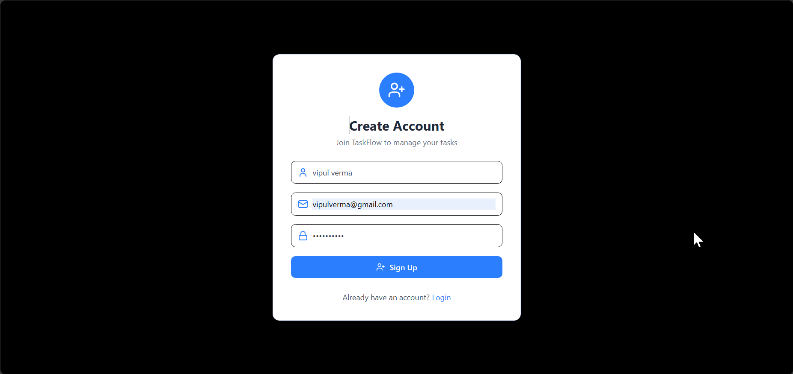
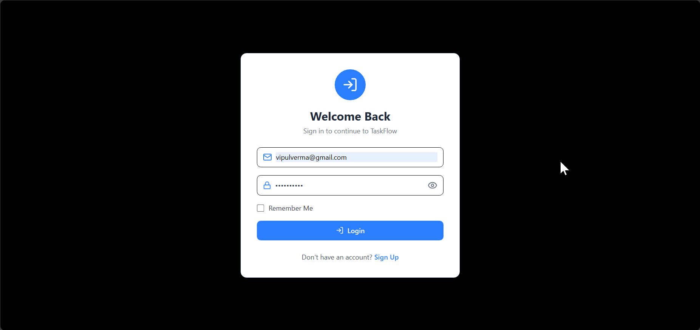
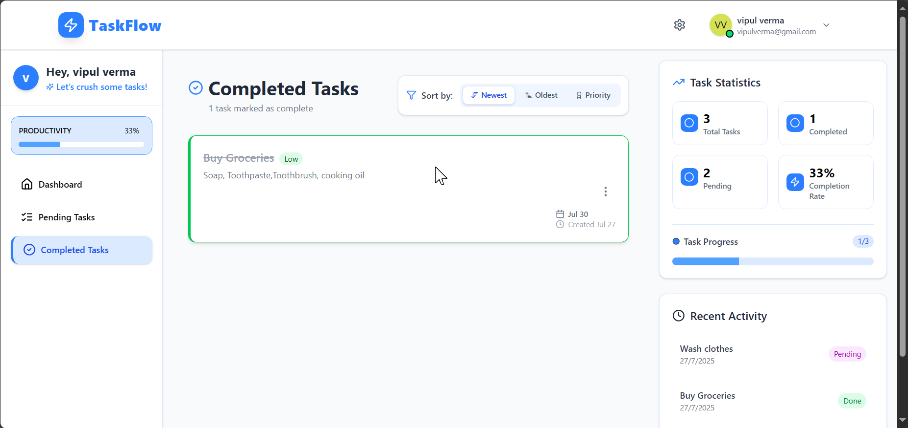
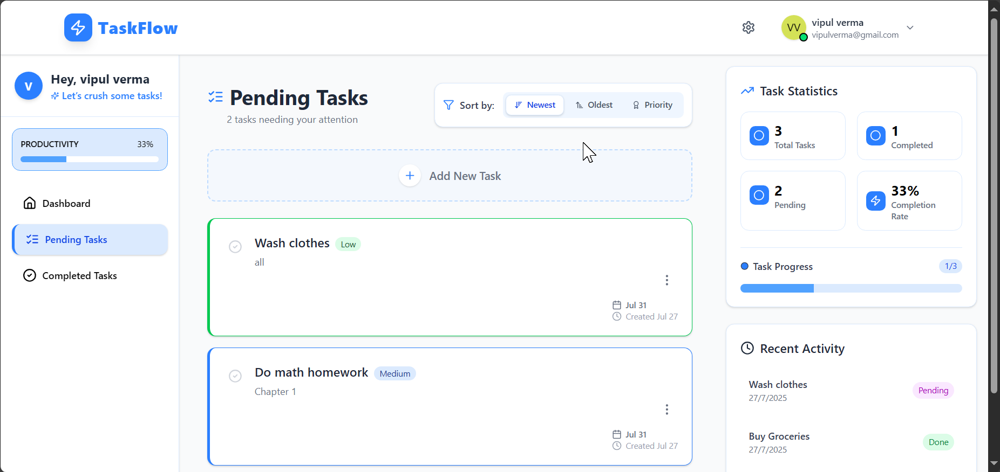
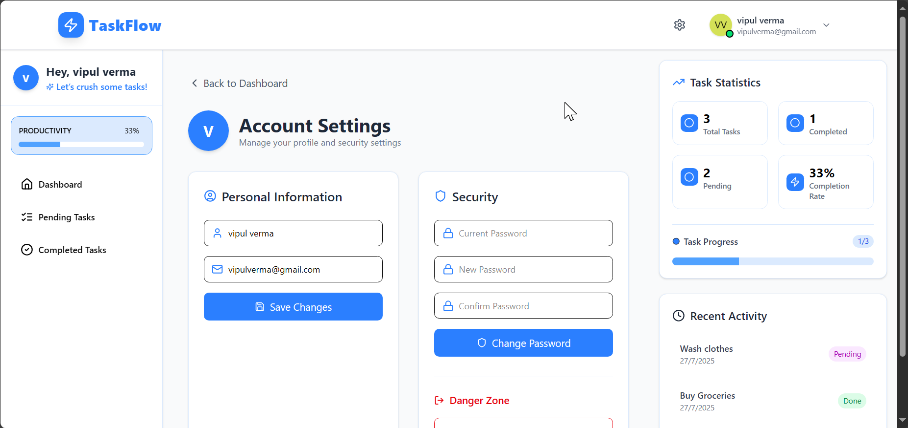

# TaskFlow

**TaskFlow** is a full-stack MERN (MongoDB, Express.js, React, Node.js) application designed to help users efficiently manage their tasks.It allows users to sort tasks by priority and due dates, making it easy to keep track of completed and pending tasks. The application ensures that user data is secure and accessible only to authorized users, fostering a productive environment for task management.

---

## Features

- Users can register and log in to their accounts.
- Personal dashboard for authorized users to add, edit, and delete their tasks.
- Sorting options for tasks by priority and due dates.
- Clear distinction between completed and pending tasks.
- Fast UI built with Tailwind CSS.
- RESTful API using Express and MongoDB.
- User-friendly interface for efficient task management.

## Tech Stack

### Frontend

- **React**
- **React Router DOM**
- **Tailwind CSS**
- **Vite**
- **Axios**
- **react-icons**
- **react-toastify**

### Backend

- **Node.js**
- **Express**
- **MongoDB** + **Mongoose**
- **dotenv**
- **cors**
- **nodemon**
- **bcryptjs**
- **cookie-parser**
- **jsonwebtoken**

---

## Screenshots

### User Registration

### User Login

### User Personal Dashboard

### Completed Task

### Pending Task

### Profile setting

